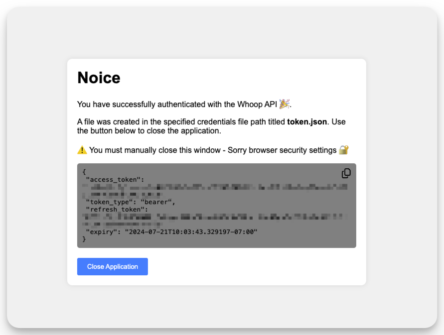

# Get Started

MyWhoop requires a few one-time setup steps to get started. The primary steps include setting up a Whoop application in the Whoop Developer Portal and setting up MyWhoop on your local machine or server. Once you have completed these steps, you can start using MyWhoop to interact with your Whoop data as you see fit.


The following steps will guide you through the process of setting up MyWhoop on your local machine or server.

## Prerequisites

1. [Docker](https://docs.docker.com/get-docker/) installed on your local machine or server. You can use Podman as an alternative to Docker. This guide will use Docker as the container runtime.

2. A Whoop account. You need to use your Whoop account to create a new application in the Whoop Developer Portal.

3. A Linux or MacOS environment. If you are using Windows, consider using Windows Subsystem for Linux (WSL2) for a better user experience. 

> [!NOTE]
> You can use MyWhoop on Windows natively through the Windows binary of MyWhoop. However, this guide will focus on using MyWhoop with Docker.    

4. A web browser to access the Whoop Developer Portal and login to your Whoop account. You will use a web browser to create the JSON Web Token (JWT) token required to interact with the Whoop API.


## Steps 

1. Open a web browser session and log into the [Whoop Developer Portal](https://developer-dashboard.whoop.com/login) 


2. Click on the `Create New Application` button to start creating a new application.


3. Fill out the application details. You can use the following details as a guide to fill out the application details.


    | Field | Description | Required | Example |
    |---|----|---|--|
    | Name | The name of your application. | Yes | `my-custom-app` |
    | Logo` | The logo for your application. | No | - |
    | Contacts | The contact information for your application. | Yes | `email@example.com` |
    | Privacy Policy | The URL to your application's privacy policy. | No | `https://example.com/privacy` |
    | Redirect URIs | The redirect URIs for your application. | Yes | `http://localhost:8080/redirect, https://localhost:8080/redirect` |
    | Scopes | The scopes required for your application. | Yes | `read:recovery, read:cycles,read:sleep, read:workout, read:profile, read:body_measurement` |
    | Webhook URL| The URL for the webhook endpoint. | No | - |

> [!NOTE]
> The redirect URIs are required for the Whoop authentication flow.  Use the values `http://localhost:8080/redirect, https://localhost:8080/` as the redirect UTLs. You can change the port number if you are using a different port.

    


4. Click on the `Create Application` button to create the application. You will be redirected to the application details page.

5. Copy the `Client ID` and `Client Secret` from the application details page. You will use these values to authenticate with the Whoop API. 

> [!WARNING]
> These values are sensitive and should be kept secret. Do not share these values with anyone. I recommend storing these values in a secure location such as a password manager.


    

6. Open a terminal window and set the `WHOOP_CLIENT_ID` and `WHOOP_CLIENT_SECRET` environment variables with the values you copied from the Whoop Developer Portal.


    ```shell
    export WHOOP_CLIENT_ID=<your client id>
    export WHOOP_CLIENT_SECRET=<your client secret>
    ```

7. Download the MyWhoop Docker image.

    ```shell
    docker pull ghcr.io/karl-cardenas-coding/mywhoop:v1.0.0
    ```

8. Create a directory where you want to store the MyWhoop data and credentials token. The command below creates a folder in your home directory and changes to that directory.
    
    ```shell
    mkdir -p ~/mywhoop/data && cd ~/mywhoop/data
    ```

9. Issue the MyWhoop login command to authenticate with the Whoop API and save the authentication token locally. The `-n` flag is used to disable auto-open in the browser.  If you are using the binary version of MyWhoop, you can use the `login` command without the `-n` flag.

    ```shell
    docker run --publish 8080:8080 \
    --volume $PWD:/data  \
    -e WHOOP_CLIENT_ID=$WHOOP_CLIENT_ID \
    -e WHOOP_CLIENT_SECRET=$WHOOP_CLIENT_SECRET  \
    ghcr.io/karl-cardenas-coding/mywhoop:v1.0.0 login \
    --no-auto-open \
    --credentials /app/token.json
    ```

    ```
    time="2024/07/05 19:14:25" level=INFO msg="Listening on port 8080. Visit http://localhost:8080 to autenticate with the Whoop API and get an access token."
    ```

10. Open a web browser and navigate to `http://localhost:8080` to authenticate with the Whoop API. Click on **Login** to authenticate with the Whoop API. You will be redirected to the Whoop authentication page. Provide your Whoop credentials to authenticate with the Whoop API. The authentication token is saved in the `~/mywhoop/data` directory.

    

11. Click on **Grant** to allow MyWhoop to receive an authentication token from the Whoop API. A success message will be displayed in the browser.

    
    
12. Click on **Close Application** and close the browser tab. 

> [!NOTE]
> The authentication token is valid for 1 hour. If the token expires, you will need to re-authenticate with the Whoop API. You can use the `login` command to create a new token. 


13. Issue the MyWhoop `dump` command to download all your Whoop data and save it to a local file. The `--location` flag is used to specify the location to save the Whoop data file. 

    ```shell
    docker run --publish 8080:8080 --volume $PWD:/app \
    -e WHOOP_CLIENT_ID=$WHOOP_CLIENT_ID \
    -e WHOOP_CLIENT_SECRET=$WHOOP_CLIENT_SECRET \
    ghcr.io/karl-cardenas-coding/mywhoop:v1.0.0 dump \
    --credentials /app/token.json \
    --location /app
    ```

    Upon successful download, the Whoop data will be saved in the `~/mywhoop/data/` directory. The final output will look similar to the following:

    ```
    time="2024/07/09 23:51:52" level=INFO msg="data written to file" file=/app/user.json
    time="2024/07/09 23:51:52" level=INFO msg="All Whoop data downloaded successfully"
    ```

14. To review the downloaded data, navigate to the `~/mywhoop/data` directory and open the `user.json` file. The file contains all the Whoop data downloaded from the Whoop API.

    ```shell
    cat ~/mywhoop/data/user.json | jq
    ```

    ```json
    {
    "user_data": {
        "user_id": 11111111,
        "email": "example@example.com",
        "first_name": "John",
        "last_name": "Doe "
    },
    "user_mesaurements": {
        "height_meter": 1.48,
        "weight_kilogram": 66.678085,
        "max_heart_rate": 198
    },
    ...// Additional data follows
    }
    ```


15. You have successfully set up MyWhoop on your local machine or server. You can now use MyWhoop to interact with your Whoop data as needed. For more information on the available commands and options, refer to the [Commands Reference](./commands_reference.md) section. 